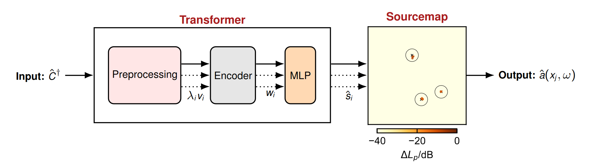

# BeBeC2024-S01
Includes the source code for the 2024 Berlin Beamforming Conference (BeBeC) paper "Towards generalization of frequency-invariant deep learning models for grid-free source characterization"

<details>
  <summary>
  <font size="+1">Abstract</font>
  </summary>
    Within recent years, several data-driven microphone array methods showed promising potential regarding their performance in accurately characterizing multiple sound sources from microphone array data. These methods have one thing in common: they were trained using virtually supervised learning. 
    While excellent performance is frequently reported on synthetic data for virtually trained models, a typical observation in experimental applications is performance degradation due to the differently distributed data in the experimental domain.
    To date, the experimental generalization behavior of these methods has yet to be explored. 
    Another largely unexplored aspect is the performance of grid-free data-driven methods when training with microphone array data from multiple frequencies using a single model architecture. 
    This work analyzes the characterization performance of a grid-free deep learning method that is trained with microphone array data from multiple frequencies and compares it to the performance of single-frequency trained models.
    Furthermore, the generalization behavior for the frequency-invariant method is examined in the virtual and experimental domains. A sizeable dataset is employed to obtain statistically meaningful results. The experimental data is based on the MIRACLE dataset, a recently published database containing measured impulse responses from a loudspeaker at various locations under anechoic conditions.
</details>

<p align="center">
   <br>
  Measurement setup of the MIRACLE (R2) dataset.
</p>


<p align="center">
   <br>
  Transformer Architecture.
</p>


## Installation

Install the package via pip

```
pip install -e .
```


